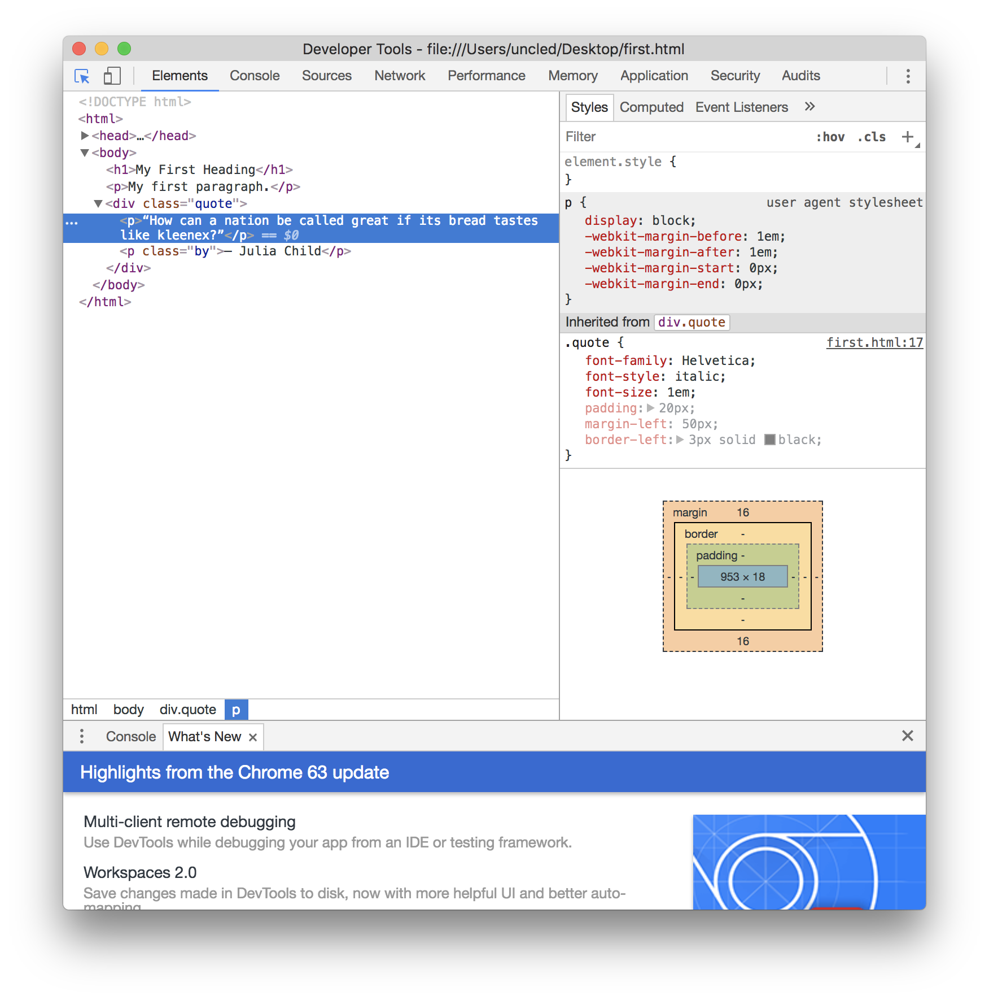
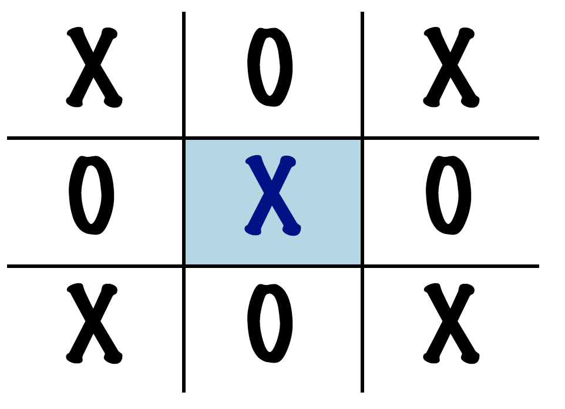

# Intro to CSS

The same way how HTML defines the structure of a document you can think
of CSS as the language that describes the format and layout, things like fonts, colors, spacing, etc. 
CSS stands for Cascading Style Sheets.

## Your first CSS code

Other than HTML, CSS does not have tags and attributes, but instead a completely different syntax. It can be embedded in HTML though, with a `` tag.

So if you go back to your HTML document, let's style the `<h1>` heading and the body of the document by adding the following to your HTML document...

~~~~ html

~~~~

## Selectors and properties

CSS consists of `Selectors` and `Properties`, Selectors are used to identify what you are applying the styles to and the properties describe what it is that you are changing.

So in the above example `h1` is a selector, that says that you are applyinfg things to your `h1` tag in your HTML document, and what's in side the `{`...`}` are the properties, that describe what styling you want to apply.

In this example, we are changing the Font & Font Size, the foreground andbackground colors, and the padding around the text. `font-family`, `font-size` are called properties and `Helvetica`, `40px` are called values.

There is a very broad range of CSS properties, and we are only looking at a few here, every property has a type of values that make sense and we will look into the most basic ones.

## Colors

One of the most basic aspect of any styling of course are colors. There is a set of CSS properties that take a color as their values. The most important ones are already used in the example above `color` and `background-color`.

There are various ways to specify colors, like the short names used above like `aqua` or `navy`, the most popular way to specify a color in CSS though is through the HEX values.
HEX values are hexadecimal representation of RGB values and look like this `#001f3f` or `#7FDBFF`. You can select from over 16 million colors like this.

There are a lot of palettes or color pickers that help you find the color that you are looking for. here is one of my favourite ones.

https://color.adobe.com

As an example try, to change the colors of your CSS style from the blue colors to a nice green.

## Fonts

CSS let's you control all aspects of fonts, to add typography to your HTML pages. One of the the most important property is `font-family` specifying which font to use. Example values are `Arial`,`Times`,`Georgia`. You can specify multiple fonts in sequence as a fall back if a font is not available, so something like `Helvetica, Arial, sans-serif` would try to use Helvetica first, then Arial, and if neither of those are available the browser would use any other sans-serif font.

Font size can be specified by by the `font-size` property. CSS allows for a range of units, two of the most common ones are `px` for pixels and `em` which is relative to the font size in the browser and by default 1em equals 16px.

Two other common properties are `font-style` (values of `italic`, `oblique`, `normal`) and `font-weight` (values ranging from 100 to 900).

## Box Model (Margin, Border, Padding and Content)

CSS works on a "Box Model" which assumes that every HTML element for layout purposes is in a box. And the box is made up of a margin, a border, padding and the content.

... or more specificly ...

all of those can be controlled with the `margin`,`border`,`padding` properties. there are individual `padding-left` or `margin-top` variants of the properties, that let you set the property for one side only. the `margin-*` and `padding-*` properties have values with `px` or `em` units. The border specifies also color and type, so an example would be, `border: 5px solid red;`

## Classes

One of the most common ways of applying styles to elements in an HTML document is through classes. Elements in HTML have a `class` attribute. For example 

~~~~ html

“How can a nation be called great if its bread tastes like kleenex?”

― Julia Child

~~~~

and the corresponding styling in CSS, where the classes `quote` and `by` are referred to by `.quote` and `.by` in the CSS selectors.

~~~~ css

.quote {
    font-style: italic;
    font-size: 1em;
    padding: 20px;
    margin-left: 50px;
    border-left: 3px solid black;
}

.by {
    font-style: normal;
    font-size: 0.75em;
    margin-left: 20px;
    font-weight: 700;

}

~~~~

As you can see properties are inherited from the `
` tag with the `quote` class to the `
` tags with the quote and the attribution.

## Pseudo Classes

A special case of classes are so-called pseudo classes. There are a range of mildly useful pseudo classes around styling links and special cases of layout. One of the most useful pseudo class on desktop is `:hover` which let's you change the appearance of an element when the mouse cursor is over it. so on the quote example, you could have something like this:

~~~~ css

.quote:hover {
    background-color: #dddddd;
}

~~~~

## Animations

CSS also allows you to animate things. in CSS you define animations with `@keyframes` and then reference them.

~~~~ css

@keyframes highlight {
    0%   {background-color: red;}
    25%  {background-color: yellow;}
    50%  {background-color: blue;}
    100% {background-color: green;}
    }

.quote:hover {
    animation-name: highlight;
    animation-duration: 4s;
}
    
~~~~

## Tooling: Developer Tools

In Chrome, you can find the "Developer Tools" in the "View -> Developer" menu, which is extremely helpful when debugging CSS and HTML. See the screenshot below.

## Homework

Recreate the tic tac toe board but this time without any images, and 
when you hover over the X or O's, the background and the color of the X's O's 
change. Animations are a bonus. Could look something like this...

